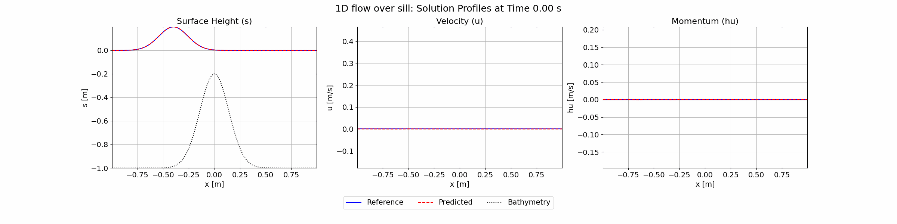

# SWE-PINN

SWE-PINN is a PINN solver for solving the Shallow-Water equations (SWE) developed at École de technologie supérieure within the group [GRANIT](https://www.etsmtl.ca/recherche/laboratoires-et-chaires-ets/granit) by Mathieu Mullins.

The code was built with [JAX](https://docs.jax.dev/) on top of the existing [JAX-PI](https://github.com/PredictiveIntelligenceLab/jaxpi/) code.

The SWE-PINN code was used to write Mathieu Mullins' dissertation: "Réseaux de neurones informés par la physique pour la
résolution d’équations de mécanique des fluides".

## Abstract

This thesis explores the application of Physics-Informed Neural Networks (PINNs) to moving interface problems using the level set method, as well as to free surface flows governed by the Shallow Water Equations (SWE). Specifically, we highlight the performance of the PirateNet architecture, which integrates improvements such as sequence-to-sequence training, random weight factorization, gradient-norm-based loss term balancing, causal training, and the incorporation of random Fourier features.

For moving interface problems, the enhanced PINN demonstrated superior capabilities in solving Zalesak’s disk and a complex case involving significant interface deformation, the time-reversed vortex flow, achieving an error of $L^2 = 0.81\%$ in the latter. Unlike classical numerical methods, PINNs can capture interface evolution without the need for upwind numerical stabilization or geometric reinitialization. Furthermore, although the addition of an Eikonal-based regularization term may improve results under certain conditions, it must be carefully weighted to avoid adverse effects.

Regarding the Shallow Water Equations, the enhanced PINN outperformed the standard PINN by accurately predicting free surface evolution, including in the presence of variable bathymetry and interfering waves. An error of $L^2_h = 0.30\%$ was achieved for the 1D wave propagation over a hump test case, while maintaining very low mass loss and accurately capturing the wave speed. However, despite reliable height prediction, PINNs struggle to model velocity fields accurately in regions with strong gradients. Numerical viscosity can help reduce this error, but it significantly increases computational cost, especially in 2D.

A key finding of this study is that, despite their promising performance, PINNs remain substantially more computationally expensive than traditional numerical methods. While inference is fast, the initial model training requires significant time, limiting their practicality for direct PDE problems.

In summary, this thesis demonstrates that the enhanced PINN equipped with the discussed improvements represents a meaningful advancement in applying PINNs to moving interface problems and free surface flows. While further development is needed to fully match the precision of classical numerical methods, PINNs offer an appealing alternative in contexts where real data can be integrated to refine predictions and improve physical modeling.

## Quickstart

This code was built for GPU usage on HPC. Our code was tested on the Digital Research Alliance of Canada's [Beluga](https://docs.alliancecan.ca/wiki/B%C3%A9luga/) and [Cedar](https://docs.alliancecan.ca/wiki/Cedar) clusters with 1 GPU.
It was tested with the following versions:

- Python 3.11.5
- JAX 0.4.30
- CUDA 12.2

The code uses [Weights & Biases](https://wandb.ai/site) to log and monitor training metrics. Before starting, make sure you have a working WandB account with the API key.

Here are the steps to follow before starting a training run:

Once logged into the cluster, move to the desired folder and load the proper modules:
```
cd ~/projects/group/account/
module load StdEnv/2023 python/3.11.5 cuda/12.2
```

Clone the repo, preferably using SSH:
```
git clone git@github.com:m-mullins/SWE-PINN.git
```

Create and activate a virtual environment:
```
virtualenv env
source env/bin/activate
pip install--no-index--upgrade pip
```

Enter WandB API Key:
```
WANDB__SERVICE_WAIT=300 wandb login API-KEY
```

Install requirements:
```
cd SWE-PINN
pip install -r requirements.txt
```

## Starting a training run

Here are the steps to follow to start a training run. We will use the 1D SWE problem as an example (``swe_hump_claw``).

Modify the main.py to choose the configuration you want to train:
```
nano swe_hump_claw/main.py
```

If you want to run ``plain.py``, modify the config_flags to this:
```
config_flags.DEFINE_config_file(
    "config",
    "./configs/plain.py",
    "File path to the training hyperparameter configuration.",
    lock_config=True,
)
```

To start training:
```
sbatch scripts/train_swe_hump.sh
```

Since most of DRAC's clusters are offline, all training runs are offline runs for WandB tracking. Once training is over, the outfile will contain the line needed to sync the run to your WandB account.
```
nano outfiles/swe.out
```
The line to copy should be at the very end, it begins with `wandb sync`. Paste the line in the terminal:
```
wandb sync /project/1234567/account/SWE-PINN/swe_hump_claw/wandb/offline-run-YYYYMMDD_123456789
```
After a few moments, the run will be available on your WandB account.

## Results

### Burgers' 1D


### Burgers' 2D


### SWE 1D: flow over a hump


### SWE 2D: radial dam break
